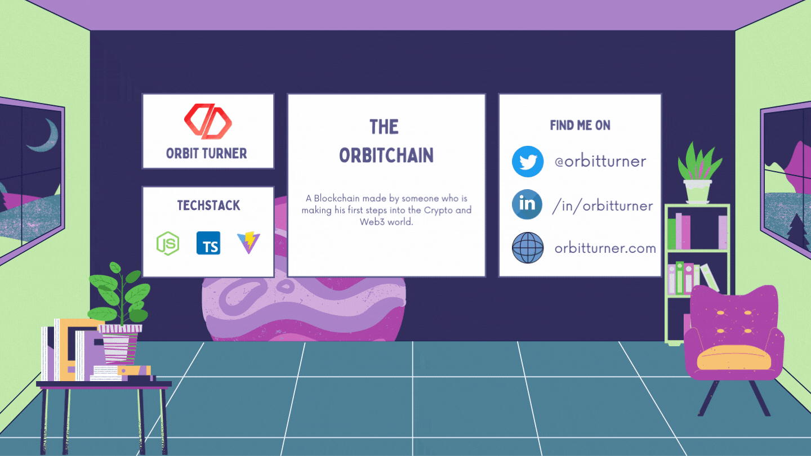

# 🟢 THE ORBIT CHAIN 🔗
[](https://github.com/orbitturner/ORBITCHAIN)
[](https://github.com/orbitturner/ORBITCHAIN)
[](https://github.com/orbitturner/ORBITCHAIN)
[](https://github.com/orbitturner/ORBITCHAIN)
[](https://github.com/orbitturner/ORBITCHAIN) [](https://github.com/orbitturner/ORBITCHAIN)

**ORBITCHAIN** is a Blockchain made by someone who is making his first steps into the Crypto and Web3 world. This is Inspired by https://blockchaindemo.io/

<p align="center">
  <a href="http://orbitturner.com/"></a>
</p>


<h1 align="center">INSTALLATION</h1>
<p align="center">
<a href="https://github.com/orbitturner/ORBITCHAIN"></a>
<a href="https://github.com/orbitturner/ORBITCHAIN/issues/new/choose"></a>
</p>
<br/>

___
## 📚 Table Of Contents 📑
- [🟢 THE ORBIT CHAIN 🔗](#---the-orbit-chain---)
  * [📚 Table Of Contents 📑](#---table-of-contents---)
  * [💨 What is this for? 🤔](#---what-is-this-for----)
  * [✨ Key Features 🎯](#--key-features---)
  * [📥 HOW TO RUN IT ? 🔰](#---how-to-run-it-----)
  * [🤔 HOW IT WORKS ? 🤔](#---how-it-works-----)
  * [⚙ Usage:  🎚](#--usage-----)
  * [Configuration Options](#configuration-options)
  * [Contributing ❤](#contributing--)
  * [Issue Reporting](#issue-reporting)
  * [GREETINGS](#greetings)
  * [Author](#author)
  * [License](#license)


___

## 💨 What is this for? 🤔

**ORBITCHAIN** is a A simple `blockchain` implemented in JS (***for learning purposes***).


> **Note:** This repository can evolve and become a web platform or anything in the future i'm starting with basic stuff but whatever you'll see was not planned 🤦🏿‍♂️.


## ✨ Key Features 🎯

* Create and Play with **`individual blocks`**.
* **`Chain Blocks`** One by One and see how a real BlockChain is working.
* Learn how to get money from **`Mining`** and `Proof of Work` concept.
* Create a **`Wallet`** and make `Transactions` using your ***public/private keypair***.
* ✅ HAVE FUN !! 🥳🥳

___

## 📥 HOW TO RUN IT ? 🔰

```bash
# Clone this repository
$ git clone https://github.com/orbitturner/ORBITCHAIN

# Go into the repository
$ cd ORBITCHAIN

# Install dependencies
$ npm install

# Run the app
$ npm start
```


___
## 🤔 HOW IT WORKS ? 🤔

❤❤ *Coming Soon !* ❤❤

___


## ⚙ Usage:  🎚

❤❤ *Coming Soon !* ❤❤


___
## Configuration Options

*Coming Soon !*
___
## Contributing ❤

👋🏾 Pull requests are welcome! 
___

## Issue Reporting

If you have found a bug or if you have a feature request, please report them at this repository issues section. Please do not report security vulnerabilities on the public GitHub issue tracker. The [Responsible Disclosure Program](mailto:support@orbitturner.com) details the procedure for disclosing security issues.
___

## GREETINGS
* ❤❤ [JEFF DELANEY / FIRESHIP](https://www.youtube.com/c/Fireship) ❤❤

* ❤❤ [IBM TECHNOLOGY](https://www.youtube.com/watch?v=QphJEO9ZX6s) ❤❤

* ❤❤ [3Blue1Brown](https://youtu.be/bBC-nXj3Ng4) ❤❤

* ❤❤ [Anders Brownworth](https://youtu.be/_160oMzblY8) ❤❤

* ❤❤ [GALSEN DEV](https://discord.gg/zVm5gNnRnK) ❤❤


___
## Author

[Orbit Turner](https://orbitturner.com)

___
## License

This project is licensed under the GNU GENERAL PUBLIC LICENSE Version 3. See the [LICENSE](LICENSE) file for more info.
______________________________________________________
**❤ MADE WITH LOVE ❤**


